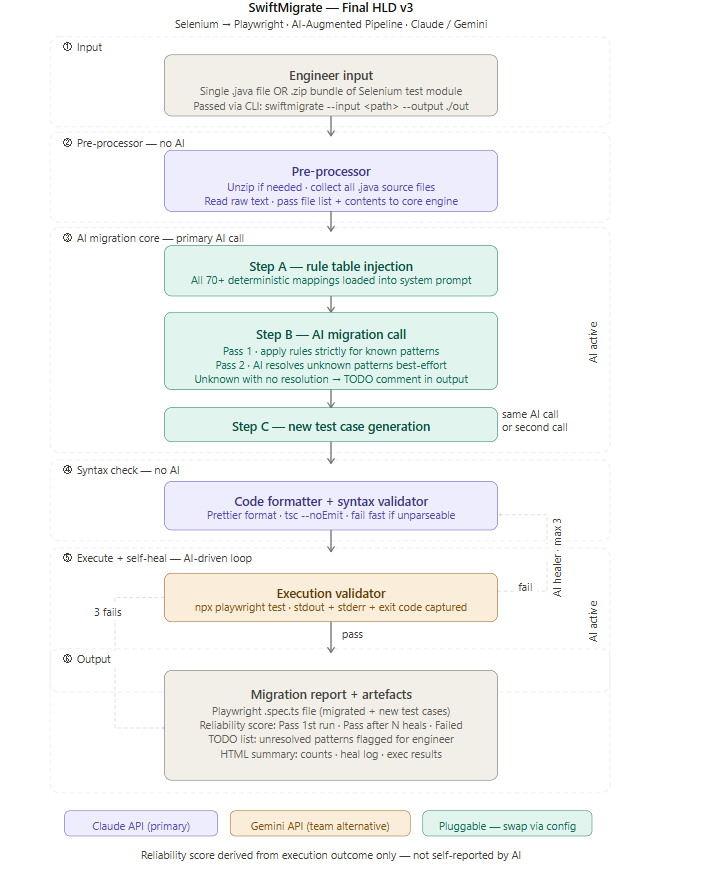

# 🚀 SwiftMigrate – AI-Powered Selenium to Playwright Migration

SwiftMigrate is an AI-driven tool that automatically converts Selenium test scripts into Playwright scripts, executes them, and intelligently self-heals failures.

---

## 💡 The Problem

Migrating Selenium test suites to Playwright is:

- ⏳ Time-consuming
- ❌ Error-prone
- 🧠 Requires deep manual effort

Teams often spend weeks rewriting and debugging scripts.

---

## ⚡ The Solution

SwiftMigrate automates the entire migration pipeline:

1. 📤 Upload Selenium script  
2. 🧹 Preprocess & clean code  
3. 🤖 Convert to Playwright using AI (Gemini)  
4. ▶️ Execute generated script  
5. ❌ Detect failures  
6. 🔁 Self-heal and retry automatically  

---

## 🧠 Key Features

- ✅ Selenium → Playwright conversion
- ✅ AI-powered transformation (Gemini)
- ✅ Automated execution with Playwright
- ✅ Self-healing failure recovery loop
- ✅ Designed for future multi-file (POM) support

---

## 🏗️ Architecture Overview

---

## 🛠️ Tech Stack

- **Frontend**: React  
- **Backend**: Node.js  
- **AI Engine**: Gemini API  
- **Automation**: Playwright  

---

## 📁 Project Structure
swiftmigrate/
├── frontend/ # React UI
├── backend/ # Node + AI + Playwright
├── docs/ # Architecture & demo flows
├── README.md

---

## ⚙️ Setup Instructions

### 1️⃣ Clone the repository

git clone <repo-url>
cd swiftmigrate

---

### 2️⃣ Backend Setup
cd backend
npm install
node server.js

---

### 3️⃣ Frontend Setup
cd ../frontend
npm install
npm run dev

---

## 🔁 Example Workflow

1. Upload a Selenium test script  
2. SwiftMigrate converts it into Playwright  
3. The script is executed automatically  
4. If execution fails → SwiftMigrate attempts auto-fix  
5. Final working script + result is displayed  

---

## 🚧 Roadmap

- 🔜 Multi-file (POM) support  
- 🔜 Script quality analysis  
- 🔜 Auto-generation of missing test cases  
- 🔜 Execution timeline visualization  
- 🔜 Learning system (failure → fix patterns)

---

## 🎯 Why SwiftMigrate is Different

Unlike basic converters, SwiftMigrate:

- Doesn’t just translate code → it **executes and validates**
- Fixes failures automatically → **reduces manual debugging**
- Moves toward a **self-improving test migration system**

---

## 🧑‍💻 Author
- Ashish Kumar
- Bharat Sharadkumar Dangra
- Jyoti Patil
- Kaushik Mishra
- Muktapuram Sridhar Sai Raghavi Reddy
- Pranavnath Jujaray
- Seema Mittal 

Built as part of a Hackathon 🚀

---

## ⭐ If you like this project

Give it a star ⭐ and share feedback!